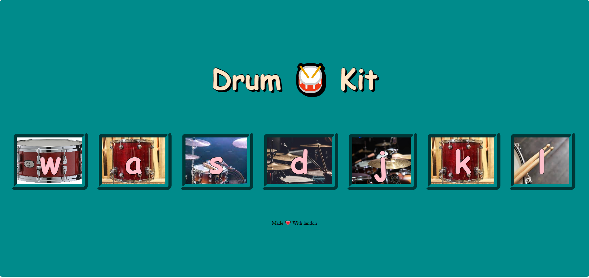

# 🥁 Drum Kit Project

An interactive and fun **Drum Kit Web Application** built using **HTML, CSS, and JavaScript**.  
Users can play different drum sounds by clicking the drum buttons or pressing the corresponding keyboard keys.

---

## 🔗 Live Demo
Add your live demo link here:

[Click here to view the Live Demo](https://vidyakhavare.github.io/Drum-Kit/)

---

## 📂 Project Structure

Drum-Kit/  
│ 
├── .vscode/ 
├── images/ 
├── music/ 
├──  git/ 
├── drum.css 
├── drum.js 
└──index.html 

---

## ✨ Features

- 🎵 Play drum sounds on button click  
- ⌨️ Keyboard support for each drum  
- 💥 Button animation on interaction  
- 🎨 Clean and simple UI  
- 🔰 Easy for beginners to understand  

---

## 🛠 Technologies Used

- **HTML5**
- **CSS3**
- **JavaScript (Vanilla JS)**

---

## 📸 Screenshot

Add your screenshot here:

